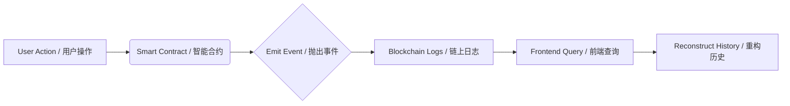

# 🛡️ Decentralized Product Provenance & Warranty System
# 去中心化产品溯源与保修系统

<div align="center">

[](https://opensource.org/licenses/MIT)
[](https://reactjs.org/)
[](https://www.typescriptlang.org/)
[](https://docs.soliditylang.org/)
[](https://docs.ethers.org/)
[](https://tailwindcss.com/)

**A transparent, immutable, and secure product lifecycle management system built on Ethereum.**
<br>
**基于以太坊构建的透明、不可篡改且安全的产品全生命周期管理系统。**

[Live Demo](https://your-demo-link.com) · [Report Bug](https://github.com/yourusername/repo/issues) · [Request Feature](https://github.com/yourusername/repo/issues)

</div>

---

## 📖 Overview / 简介

**Product Provenance dApp** is a full-stack decentralized application designed to combat counterfeiting and streamline warranty management. By tokenizing products as NFTs (ERC-721), we ensure that every product's history—from manufacturing to retail, and from sale to service—is recorded immutably on the blockchain.

Unlike traditional systems, this dApp features an **Event-Driven Architecture**, utilizing off-chain indexing for cost-effective and fast data retrieval, while keeping the source of truth on-chain.

**产品溯源 dApp** 是一个全栈去中心化应用，旨在打击假冒伪劣产品并简化保修管理流程。通过将产品代币化为 NFT (ERC-721)，我们确保产品的每一段历史——从制造到零售，从销售到售后服务——都被不可篡改地记录在区块链上。

不同于传统系统，本应用采用 **事件驱动架构 (Event-Driven Architecture)**，利用链下索引实现低成本、高效率的数据检索，同时保证数据的真实性由链上锁定。

---

## ✨ Key Features / 核心特性

- **🏭 Role-Based Portals**: Distinct interfaces for Manufacturers, Retailers, Customers, and Service Centers.
  <br> **基于角色的门户**：为制造商、零售商、客户和服务中心提供独立的专属操作界面。
  
- **📦 NFT-Based Ownership**: Each product is an ERC-721 token, ensuring verifiable ownership transfer.
  <br> **NFT 所有权管理**：每个产品都是一个 ERC-721 代币，确保所有权转移可验证、可追溯。

- **🛡️ Automated Warranty**: Warranty logic (activation, expiration) is enforced by smart contracts.
  <br> **自动化保修**：保修逻辑（激活、过期）由智能合约强制执行，杜绝人为篡改。

- **📜 Complete Lifecycle Tracking**: Visualize the entire history of a product (Mint → Transfer → Claim → Repair).
  <br> **全生命周期追踪**：可视化展示产品的完整历史（铸造 → 转移 → 索赔 → 维修）。

- **🦊 Seamless Wallet Integration**: Full MetaMask support with robust error handling and network detection.
  <br> **无缝钱包集成**：完美支持 MetaMask，具备强大的错误处理和网络自动检测功能。

- **⚡ Dual Mode**: Supports both **Real Blockchain Mode** (Sepolia/Local) and **Demo Mode** (No wallet required).
  <br> **双模式支持**：同时支持 **真实区块链模式**（Sepolia/本地）和 **演示模式**（无需钱包即可体验）。

---

## 📸 Screenshots / 界面截图

| Customer Portal (客户门户) | Manufacturer Dashboard (制造商后台) |
|:---:|:---:|
|  |  |

| Product Timeline (产品时间轴) | Mobile Responsive (移动端适配) |
|:---:|:---:|
|  |  |

---

## 🛠️ Tech Stack / 技术栈

### Frontend (前端)
- **Framework**: React 18 + Vite
- **Language**: TypeScript
- **Styling**: Tailwind CSS v4
- **Components**: Shadcn UI (Radix Primitives)
- **Icons**: Lucide React

### Blockchain (区块链)
- **Smart Contracts**: Solidity ^0.8.20
- **Standards**: ERC-721 (OpenZeppelin)
- **Interaction**: Ethers.js v6
- **Development**: Hardhat

---

## 🏗️ Architecture / 架构设计

This project implements a robust **Event-Driven Architecture** to handle historical data efficiently.
本项目实施了稳健的 **事件驱动架构**，以高效处理历史数据。



Instead of storing expensive arrays on-chain, we leverage indexed events (`ProductRegistered`, `Transfer`, `WarrantyClaimSubmitted`) to reconstruct the product timeline on the client side. This reduces Gas costs by over 80%.

我们不采用昂贵的链上数组存储方式，而是利用索引事件（如 `ProductRegistered`, `Transfer`）在客户端重构产品时间轴。这使得 Gas 成本降低了 80% 以上。

---

## 🚀 Getting Started / 快速开始

### Prerequisites / 前置要求
- Node.js 16+
- MetaMask Browser Extension (MetaMask 浏览器插件)

### Installation / 安装步骤

1. **Clone the repository / 克隆仓库**
   ```bash
   git clone [https://github.com/yourusername/product-provenance-dapp.git](https://github.com/yourusername/product-provenance-dapp.git)
   cd product-provenance-dapp
   ```

2. **Install dependencies / 安装依赖**
   ```bash
   npm install
   ```

3. **Configure Environment / 配置环境**
   - Edit `src/lib/contractConfig.ts` with your contract address.
   - 编辑 `src/lib/contractConfig.ts`，填入您的合约地址。

4. **Run the dApp / 启动应用**
   ```bash
   npm run dev
   ```

### Smart Contract Deployment (Optional) / 部署智能合约（可选）

If you want to deploy your own instance:
如果您想部署自己的合约实例：

```bash
# Start local node / 启动本地节点
npx hardhat node

# Deploy contract / 部署合约
npx hardhat run scripts/deploy.js --network localhost
```

---

## 📖 Usage Guide / 使用指南

1. **Connect Wallet (连接钱包)**
   - Click the "Guest User / Connect" button in the sidebar.
   - 点击侧边栏底部的 "Guest User / Connect" 按钮。

2. **Manufacturer (制造商)**
   - Use the Manufacturer portal to `Mint` a new product.
   - 使用制造商门户 `Mint`（铸造）新产品。

3. **Retailer (零售商)**
   - Connect as a retailer to `Transfer` the product to a customer.
   - 以零售商身份连接，将产品 `Transfer`（转移）给客户。

4. **Customer (客户)**
   - View your product, check warranty status, and `Submit Claim` if needed.
   - 查看您的产品，检查保修状态，如有需要可 `Submit Claim`（提交索赔）。

5. **Verify (验证)**
   - Anyone can use the "Verify" tab to check a product's authenticity using its ID or Serial Number.
   - 任何人都可以使用 "Verify" 标签页，通过 ID 或序列号验证产品真伪。

---

## 🛣️ Roadmap / 路线图

- [x] Core ERC-721 Implementation / 核心 ERC-721 实现
- [x] Role-Based Access Control / 基于角色的访问控制 (RBAC)
- [x] Frontend UI with Shadcn / 基于 Shadcn 的前端 UI
- [x] Event-Based History Timeline / 基于事件的历史时间轴
- [ ] Integration with The Graph (Subgraph) / 集成 The Graph
- [ ] IPFS Support for Product Images / 支持 IPFS 存储产品图片
- [ ] Mobile App (React Native) / 移动端 App

---

## 🤝 Contributing / 贡献

Contributions are what make the open-source community such an amazing place to learn, inspire, and create. Any contributions you make are **greatly appreciated**.

开源社区之所以如此美妙，是因为有大家的贡献。我们 **非常欢迎** 您的任何贡献。

1. Fork the Project
2. Create your Feature Branch (`git checkout -b feature/AmazingFeature`)
3. Commit your Changes (`git commit -m 'Add some AmazingFeature'`)
4. Push to the Branch (`git push origin feature/AmazingFeature`)
5. Open a Pull Request

---

## 📄 License / 许可证

Distributed under the MIT License. See `LICENSE` for more information.
基于 MIT 许可证分发。详情请参阅 `LICENSE` 文件。

---

<div align="center">
  <p>Don't forget to ⭐ star this repo if you found it useful!</p>
  <p>如果觉得项目有用，请别忘了点个 ⭐ Star！</p>
  <p>Built with ❤️ by YourName</p>
</div>